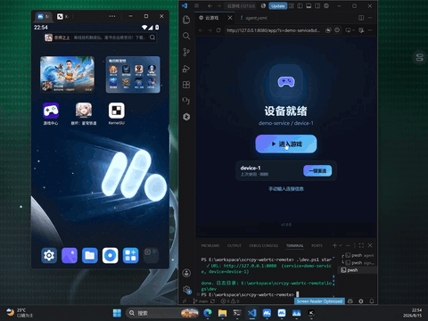

# scrcpy-webrtc-remote

**基于 WebRTC 的 Android 云手机 / 云游戏串流方案** —— 把手机/模拟器画面实时推送到浏览器，支持触控、键盘、剪贴板等完整远程操作。低延迟、抗弱网、即点即玩。

## 实机演示



> 真实设备远程串流画面（480×640 · 15fps GIF）

```
┌──────────────┐    WebSocket 信令    ┌──────────────────┐   WebSocket 信令   ┌──────────────┐
│  浏览器前端    │◄────────────────────►│  signaling 服务器 │◄──────────────────►│  agent（本机） │
│  /app/ 云游戏  │   SDP / ICE / QoS   │  (Go, 单进程)     │  register / bound  │   ADB + scrcpy │
└──────────────┘                      └──────────────────┘                    └──────┬───────┘
        ▲                                  │ 静态托管前端 / REST                       │ adb forward
        └────────────── WebRTC (pion) ◄────┴──────────────────────────────────────────┘
                     H.264 + Opus 音视频流 / DataChannel 控制                           Android 设备
```

一条完整的链路只有两个 Go 进程：

- **signaling**（`cmd/signaling`）—— 信令服务器：维护 agent 注册表、转发浏览器 ⇄ agent 的 SDP/ICE 消息、下发 ICE 服务器、提供 REST 接口并托管前端页面。
- **agent**（`cmd/agent`）—— 设备侧网关：通过 ADB 拉起 scrcpy server，把设备的 H.264/Opus 流经 WebRTC 推给浏览器，并把浏览器的触控/按键/剪贴板指令注入回设备。

浏览器端是**纯静态前端**（`signaling/static/app`），无需构建、无需 SDK，打开即用。

---

## 已实现功能

### 串流与画质

- H.264 视频 + Opus 音频 WebRTC 推流（pion/webrtc v4）
- 三档画质切换（原画 / 高清 / 清晰）—— 只调编码码率，分辨率不变
- 弱网自动降码率（阶梯式，按丢包率 25% / 50% / 75% 递减），网络恢复（持续低丢包 30s）自动回升；码率地板 `min_video_bit_rate` 防止僵尸流
- 2 秒 GOP（`i-frame-interval=2`）：弱网下远优于 scrcpy 默认 20s，30% 丢包仍可流畅
- 关键帧 IDR 前自动注入 SPS/PPS，编码器重置 / 弱网丢参数后浏览器仍能立即解码

### 抗弱网

- **NACK 重传**：pion NACK Responder（1024 包缓冲），丢包自动补发
- **RED FEC**：RFC 2198 冗余包，按丢包率 / RTT 自适应开关（随机丢包 → 开，拥塞 → 关），按协商结果动态重映射 payload type
- **PLI 两级恢复**：L1 轻量 IDR 请求（0x17）→ 无效则 L2 编码器重置（0x11）；FIR 直达 L2
- **playout-delay 扩展**：告知浏览器保持 ≤50ms 抖动缓冲，延迟与抗丢包平衡
- PTS 归一化：独立音/视频时间基线，编码器重置回绕自动重基准，避免浏览器弃帧

### 会话与可靠性

- 多实例：一个 agent 进程可同时管理多台设备（`instances` 列表）
- **预热池**：浏览器断开后 scrcpy server 保活 `warm_keep_seconds`（默认 300s），窗口内重连免冷启动；启动期暂停缓冲 + 从首个 IDR 起播，无黑屏
- scrcpy server 进程死亡检测（`stream_dead`），前端自动重连并冷启动新会话
- agent ⇄ signaling 断线自动重连（前 12 次 5s，之后 5min）+ 30s 心跳保活
- 会话抢占：新浏览器可接管设备，旧浏览器收到 `preempted` 并断开
- 端口池（默认 30000-30099）防止多实例 ADB forward 冲突

### 设备控制（DataChannel）

- 触摸 / 滚动 / 物理按键 / 文本注入（IME 上屏文字自动同步）
- 剪贴板双向同步（发送到设备 / 从设备获取，设备主动上报）
- 返回 / 主页 / 最近任务 / 通知面板 / 设置面板 / 旋转 / 熄屏亮屏
- 重置视频流（画面卡死时请求关键帧）

### 信令服务器

- `/ws/agent/{service}` agent 注册；`/ws/browser/{service}/{instance}` 浏览器信令（bound/unbound 生命周期 + 会话 ID 路由）
- `/ws/relay/{service}/{instance}` 通用 relay 通道：平台后端可在不占用会话的情况下查询设备状态（`query_status`）或发起抢占（`preempt`）
- ICE 服务器下发：STUN + TURN（静态凭据），浏览器与 agent 均从信令获取
- REST：`GET /api/agents`（在线设备列表）、`GET /api/health`、`GET /health`
- 静态托管前端（`/app/`），`GET /` 自动跳转

### 前端（/app/，云游戏式 UI）

- 入口页：服务 ID / 设备 ID（URL `?s=&d=` 自动预填）、上次会话一键重连
- 连接进度引导（连接设备 → 建立通道 → 加载画面），失败页含技术详情
- 会话中掉线自动重连（指数退避 ×5），弱网徽标 + 延迟/丢包/帧率/码率 HUD
- 设备被占用提示，可一键「接管使用」
- 设置：方向锁定、声音开关、画质切换、全屏、网络悬浮窗、开发者实时流指标、修复视频流

---

## 快速开始

### 环境要求

| 依赖 | 说明 |
|------|------|
| Go 1.22+ | 编译运行两个命令 |
| ADB | 能 `adb devices` 看到设备（真机开 USB 调试，或用模拟器） |
| Android 设备 / 模拟器 | 系统 Android 8+（scrcpy 4.0 要求），建议 API 29+ |
| 浏览器 | Chrome / Edge（现代浏览器均支持 WebRTC） |
| scrcpy-server.jar | 已随仓库提供（scrcpy 4.0，放置于仓库根目录） |

### 方式一：dev.ps1（Windows，推荐）

所有组件用 `go run` 直接运行源码，不预编译：

```powershell
# 一键：启动 signaling + agent（go run）→ 状态检查
.\dev.ps1 -Action all

# 或分步：
.\dev.ps1 -Action start    # go run 启动 signaling + agent，自动 adb connect
.\dev.ps1 -Action status   # 进程 / 健康 / agent 注册 / 端口池
.\dev.ps1 -Action stop     # 停止两个 go run 进程树
.\dev.ps1 -Action monitor  # 循环监控日志与告警
```

常用参数：`-AdbPath`（adb 路径，默认自动探测）、`-AdbHost`（默认 `127.0.0.1:16384` MuMu）、`-ServiceId / -InstanceId`、`-WebPort`、`-AudioEnabled`（模拟器无 Opus 编码器时**不要**开）。

启动成功后浏览器打开：

```
http://127.0.0.1:8080/app/?s=demo-service&d=device-1
```

### 方式二：手动 go run

```bash
# 终端 1：信令服务器
go run ./cmd/signaling -c config/signaling.yaml

# 终端 2：设备 agent
go run ./cmd/agent -c config/agent.yaml
```

---

## 配置

### config/signaling.yaml

| 字段 | 默认 | 说明 |
|------|------|------|
| `host` / `port` | `0.0.0.0` / `8080` | 监听地址 |
| `static_dir` | `./signaling/static` | 前端静态目录（app 位于其 `/app/` 下） |
| `webrtc.stun_servers` | Google STUN | 下发给客户端的 STUN |
| `webrtc.turn_servers` | 空 | TURN 列表；`auth.mode` 支持 `none` / `static`（username+credential） |

### config/agent.yaml

| 字段 | 默认 | 说明 |
|------|------|------|
| `signaling_url` | `ws://127.0.0.1:8080` | 信令服务器地址 |
| `service_id` | `demo-service` | 服务标识（浏览器用同一 ID 连接） |
| `instances[].instance_id / device_serial` | — | 每台设备一个实例；多实例 = 一台机器带多台设备 |
| `scrcpy.video_bit_rate` | 12 Mbps | 原画档码率 |
| `scrcpy.clear_bitrate / hd_bitrate` | 3 / 6 Mbps | 清晰 / 高清档 |
| `scrcpy.min_video_bit_rate` | 300 kbps | 弱网自动降码率地板 |
| `scrcpy.warm_keep_seconds` | 300 | 断连后 scrcpy 保活秒数 |
| `scrcpy.video_keyframe_interval` | 2 | 关键帧间隔（秒） |
| `scrcpy.audio_enabled` | false | 音频采集（见下方限制） |

---

## 信令协议速览

WebSocket 消息为 JSON 信封 `{type, ...}`：

| type | 方向 | 说明 |
|------|------|------|
| `register` / `registered` | agent ⇄ signaling | agent 注册 / 确认 |
| `bound` / `unbound` | signaling → agent | 浏览器接入 / 离开（携带 session_id） |
| `offer` / `answer` | browser ⇄ agent（经 signaling 转发） | SDP 协商 |
| `ice_candidate` | browser ⇄ agent | Trickle ICE |
| `ice_servers` | signaling → 双方 | ICE 服务器列表 |
| `first_frame` / `decoder_stats` / `decoder_status` | browser → agent | 首帧通知 / 解码统计 / QoS 遥测（驱动降码率与 FEC） |
| `reset_video` | browser → agent | 请求关键帧 |
| `stream_dead` | agent → browser | scrcpy 进程死亡，触发重连 |
| `preempted` | agent → browser | 设备被接管 |
| `relay`（含 `relay_id` + `payload`） | browser ⇄ agent（经 relay 通道） | 通用请求/响应，如 `query_status` → `status_resp`、`preempt` → `preempt_resp` |
| `ping` / `pong` | agent ⇄ signaling | 心跳 |

DataChannel（`control`）内为 JSON 控制指令：`inject_touch` / `inject_scroll` / `inject_keycode` / `inject_text` / `set_clipboard` / `get_clipboard` / `back_or_screen_on` / `rotate_device` / `expand_notification` / `expand_settings` / `collapse_panels` / `set_display_power` / `reset_video` / `set_quality` 等。

---

## 项目结构

```
├── dev.ps1                 # 开发调试脚本（go run，不预编译）
├── config/
│   ├── signaling.yaml      # 信令服务器配置
│   └── agent.yaml          # agent 配置
├── cmd/
│   ├── signaling/          # 信令服务器入口
│   └── agent/              # 设备 agent 入口
├── agent/                  # agent 实现
│   └── internal/
│       ├── adb/            # ADB CLI 封装（push / forward / shell）
│       ├── gateway/        # scrcpy 会话网关（协议解析、控制消息、PTS 归一化）
│       ├── portpool/       # ADB forward 端口池
│       └── webrtc/         # pion PeerConnection（NACK / RED FEC / PLI）
├── pkg/
│   ├── common/             # 共享 WebSocket 消息类型
│   ├── config/             # YAML 配置加载
│   ├── logger/             # slog 日志
│   ├── signaling/          # 信令引擎（纯 WS 逻辑，不依赖 HTTP）
│   └── types/              # 媒体 / 控制共享类型
├── signaling/
│   └── static/             # 前端静态资源
│       ├── index.html      # / 入口（跳转 /app/）
│       └── app/            # 云游戏前端（纯静态，无构建）
└── scrcpy-server.jar       # scrcpy 4.0 server（运行时依赖）
```

---

## 已知限制（当前版本）

- **音频**：依赖设备端 Opus MediaCodec 编码器。部分模拟器镜像（如 MuMu）没有该编码器，开启 `audio_enabled: true` 会导致 scrcpy server 崩溃——此类环境请保持音频关闭（默认）。
- **TURN**：支持静态凭据（`mode: static` / `none`）；尚未内置 Cloudflare Calls、coturn ephemeral 等动态凭据模式。复杂 NAT 组网需要自备 TURN 服务器。
- **鉴权**：信令与前端目前无用户鉴权（`service_id` 即连接凭证），适合内网/演示环境；对外部署需在网关层自行加认证与 TLS。
- 前端目前只提供 `/app/` 云游戏页面（无独立 SDK 包）。

---

## License

[GPL-3.0](LICENSE) — GNU General Public License v3

本项目以 copyleft 协议发布：你可以自由使用、修改与分发，但**任何衍生作品必须同样以 GPL-3.0 开源**（包含商用场景，商用不豁免开源义务）。详见 [LICENSE](LICENSE) 全文。
