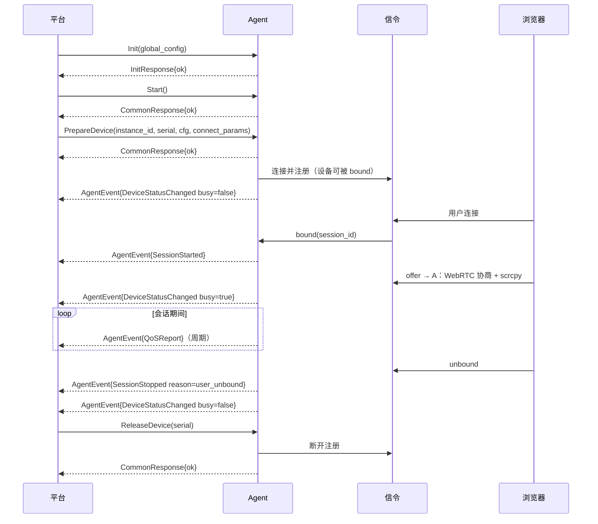

# Agent 平台接入 gRPC 接口契约

> 版本：v1.1
> 日期：2026-08-19
> 配套：`docs/PLATFORM-REFACTOR.md`
> 状态：已与 `api/agent.proto` 同步

---

## 1. 概述

### 1.1 服务定位

Agent 以**独立进程（sidecar）** 部署在云游戏 / 云手机宿主机上：平台以子进程方式拉起，
Agent 进程内起**本地 gRPC server**，向平台（任意语言）暴露管理与事件接口。
Agent 是**纯本机设备媒体引擎**：

- 不提供鉴权、不存储用户业务态；
- 会话由用户浏览器经信令服务器触发（被动转发），agent 只响应；
- 平台拥有绝对管理权限（强制断开、回收设备、改画质等）。

### 1.2 传输与安全

| 项 | 约定 |
|----|------|
| 监听地址 | `127.0.0.1:<port>`（端口由平台在**进程启动参数** `--grpc-port` 或环境变量 `AGENT_GRPC_PORT` 指定，见 §8.3） |
| 协议 | gRPC over TCP，protobuf（proto3） |
| 安全 | 默认不加密，信任宿主机本地进程；远程管理 / 跨机访问由平台侧网关负责（TLS/mTLS 不在本契约内） |
| 事件 | `StreamEvents` 为 server-streaming，平台长连接收 |

### 1.3 版本与兼容性

- proto 字段**只增不改**；预留字段号段：`100-199` 为扩展区。
- Service 版本体现在 proto package：`agentapi.v1`。破坏性变更升 v2，并行兼容。

---

## 2. Service 定义（总览）

```proto
syntax = "proto3";

package agentapi.v1;

option go_package = "scrcpy-webrtc-remote/api/gen;agentapi";

// 平台 → Agent：管理面
service AgentService {
  // 初始化：注入全局配置（监听端口已在进程启动时由 --grpc-port 指定）
  rpc Init(InitRequest) returns (InitResponse);
  // 启动：Agent 就绪（等待 PrepareDevice / 信令连接）
  rpc Start(Empty) returns (CommonResponse);
  // 优雅停止：回收所有设备与会话，释放资源
  rpc Stop(Empty) returns (CommonResponse);

  // 全局配置热更新（scrcpy 参数 / STUN / TURN / signaling 等）
  rpc ReloadConfig(ReloadConfigRequest) returns (CommonResponse);

  // 设备管理：用户连接准备阶段注入设备配置
  rpc PrepareDevice(PrepareDeviceRequest) returns (CommonResponse);
  // 设备管理：平台回收设备，断开其信令连接
  rpc ReleaseDevice(ReleaseDeviceRequest) returns (CommonResponse);
  // 查询本机所有设备状态（busy / idle）
  rpc ListDevices(Empty) returns (ListDevicesResponse);

  // 会话干预（绝对管理权）
  rpc ForceCloseSession(ForceCloseSessionRequest) returns (CommonResponse);
  // 画质档位强制设定
  rpc SetQuality(SetQualityRequest) returns (CommonResponse);
  // 平台代发控制指令
  rpc SendControl(SendControlRequest) returns (CommonResponse);

  // 强制清除设备配置：若当前有活动连接先断开，原子地清除内存中的设备配置
  rpc ResetDevice(ResetDeviceRequest) returns (CommonResponse);

  // 探活
  rpc Health(Empty) returns (HealthResponse);

  // Agent → 平台：事件流（长连接）
  rpc StreamEvents(Empty) returns (stream AgentEvent);
}
```

---

## 3. 管理面接口（平台 → Agent）

### 3.1 `Init`

Agent 生命周期第一步。注入全局配置。

**生命周期状态机（全契约唯一权威定义）**：

```text
UNINITIALIZED --Init--> INITIALIZED --Start--> RUNNING
INITIALIZED / RUNNING --Stop--> UNINITIALIZED
```

- `Init` 仅在 `UNINITIALIZED` 状态合法；
- `INITIALIZED` / `RUNNING` 状态下再次 `Init` → **`ERR_ALREADY_INIT`**
  （需先 `Stop` 回到 `UNINITIALIZED` 再重新 `Init`，不存在隐式"重初始化"）；
- 未 `Init` 即调用任何其他管理接口 → `ERR_NOT_INIT`。

| 参数 | 类型 | 必填 | 说明 |
|------|------|------|------|
| `grpc_listen_port` | int32 | 否 | 保留字段：实际监听端口在**进程启动时**由 `--grpc-port` / `AGENT_GRPC_PORT` 指定（见 §8.3），此处传 0 或省略 |
| `global_config` | `GlobalConfig` | 是 | 全局配置（见 4.1） |

**返回**：`InitResponse{ actual_port }`（恒等于进程启动端口）。

### 3.2 `Start` / `Stop`

- `Start`：Agent 进入运行态（`INITIALIZED → RUNNING`），可接受 `PrepareDevice`，
  开始建立各设备的信令连接。**幂等**：`RUNNING` 状态重复调用返回 `OK`。
- `Stop`：**优雅停止** —— 回收所有设备、断开所有会话与信令连接、释放端口池，
  状态回到 `UNINITIALIZED`。**gRPC server 不关闭**（进程常驻，平台可重新 `Init`）；
  进程退出由平台决定（发送 SIGTERM / 结束子进程，此时 gRPC server 由 agentd 优雅关闭）。
  **幂等**：任意状态调用均返回 `OK`。
  - 启动参数 `--one-shot` 时，`Stop` 完成后进程**自动退出**（适合平台希望 Agent 自收尾的场景）；默认不传则进程常驻。

### 3.3 `ReloadConfig`

全局配置热更新。**平滑生效**：影响下一次设备准备 / 下一次会话 / 下一次信令重连；
已 bound 的会话不强制踢掉（需要立即生效请配合 `ForceCloseSession`）。

| 参数 | 类型 | 说明 |
|------|------|------|
| `global_config` | `GlobalConfig` | 完整全局配置（**全量替换**，非 diff） |

### 3.4 `PrepareDevice`

**核心接口**。平台在把用户路由到本机之前，为某台设备注入配置并使其进入可服务状态：

- 若该设备已存在 → 更新配置，不中断正在进行的会话（平滑）；
- 若不存在 → 创建设备 Controller，连接信令并注册（此后可接收 `bound`）。

| 参数 | 类型 | 必填 | 说明 |
|------|------|------|------|
| `instance_id` | string | 是 | 实例 ID（信令注册标识，对应现有 `InstanceConfig.InstanceID`） |
| `device_serial` | string | 是 | ADB 设备序列号（信令注册标识） |
| `device_config` | `DeviceConfig` | 否 | 该设备本次会话的配置覆盖项（省略则用全局配置） |
| `connect_params` | `ConnectParams` | 否 | 信令连接参数（service_id / token / header 等） |

### 3.5 `ReleaseDevice`

平台回收设备：断开该设备的信令连接，正在进行的会话被终止，端口/会话资源释放。
设备从管理列表移除（`ListDevices` 不再出现）。

| 参数 | 类型 | 说明 |
|------|------|------|
| `device_serial` | string | 目标设备 |
| `reason` | string | 回收原因（透传到 `DeviceReleased` 事件） |

**非幂等**：对已移除 / 不存在的设备再次调用 → `ERR_DEVICE_NOT_FOUND`。

### 3.6 `ListDevices`

查询本机所有已准备设备的运行状态。用于平台调度系统刷新设备库存。

**返回**：`ListDevicesResponse{ repeated DeviceStatus devices }`，字段见 4.8。

### 3.7 `ForceCloseSession`

绝对管理权：强制终止指定会话（风控、欠费、管理员踢人、套餐变更）。

| 参数 | 类型 | 说明 |
|------|------|------|
| `session_id` | string | 会话 ID（由信令生成，出现在 `SessionStarted` 事件中） |
| `reason` | string | 结束原因（透传到 `SessionStopped` 事件的 `reason` 字段） |

行为：向浏览器发送 `preempted` 通知 → 停止该 `SessionCtx` → 资源回收到 warm pool。

### 3.8 `SetQuality`

按套餐强制设定画质档位。档位只改编码器码率，分辨率不变（沿用现有 `clear / hd / original` 三档）。

| 参数 | 类型 | 说明 |
|------|------|------|
| `device_serial` | string | 目标设备 |
| `level` | string | `clear`（清晰）/ `hd`（高清）/ `original`（原画） |

行为：作用于该设备**当前会话**（若有）并持久到 Controller 层（后续会话继承）；
无会话时仅持久，下一会话生效。

### 3.9 `SendControl`

平台代发控制指令（自动化测试、客服接管、风控操作）。payload 与浏览器
DataChannel 控制协议格式一致（见 `docs/cg-sdk-usage.md` 控制协议章节）。

> **语义（已确认）**：fire-and-forget —— 只保证"指令已接收并提交到设备会话"，不返回送达回执。
> 若平台后续需要回执，扩展新增 `SendControlWithAck`（独立 RPC，不破坏现有契约）。

| 参数 | 类型 | 说明 |
|------|------|------|
| `device_serial` | string | 目标设备 |
| `control` | `ControlMessage` | 见 4.9 |

### 3.10 `ResetDevice`

强制清除某设备在内存中的配置信息（per-device `DeviceConfig`）：

- 该设备当前有活动连接（WebRTC 会话 / 信令连接）→ 先断开（停止该 Controller）；
- 然后清除内存中的 per-device 配置，使其回到"仅继承全局配置"的干净状态；
- **并发防护**：`DeviceManager.Reset` 在设备级锁内将 `entry.ctrl = nil`，锁外
  `ctrl.Stop()` 关闭该 Controller 的信令 WS —— 旧 Controller 不再处理新 `bound`
  （旧会话被终止），从而**避免"刚断开连接、又被信令 `bound` 事件用旧配置重建会话"的竞态**。
  没有独立的"清除中"标志；防护由 `ctrl = nil` + WS 关闭保证。
- 设备本身不被销毁（区别于 `ReleaseDevice`）：清除后**仍保留在 `ListDevices` 列表中**，
  外部可观察状态为 `busy=false`、`signaling_connected=false`、`configured=false`
  （见 4.7 `DeviceStatus.configured`），直到下一次 `PrepareDevice` 重新注入配置并重连信令。

| 参数 | 类型 | 说明 |
|------|------|------|
| `device_serial` | string | 目标设备 |
| `reason` | string | 清除原因（透传到 `DeviceReset` 事件） |

### 3.11 `Health`

探活。返回 Agent 版本、设备数、运行时长、最近错误。

---

## 4. Message 定义

### 4.1 `GlobalConfig`

对应现有 `config.AgentConfig` 的共享部分（全设备共享）。

```proto
message GlobalConfig {
  string signaling_url = 1;           // 信令服务器地址，如 ws://127.0.0.1:8080（支持 wss://）
  string service_id = 2;              // 默认 service_id（可被 ConnectParams 覆盖）
  repeated string stun_servers = 3;   // 兜底 STUN（信令未下发时使用）
  TurnServer turn_server = 4;         // 兜底 TURN
  ScrcpyConfig scrcpy = 5;            // scrcpy / 编码参数
  string adb_path = 6;                // adb 可执行文件路径（空 = PATH 查找）
  int32 qos_interval_ms = 7;          // QoSReport 推送周期（毫秒），默认 2000
}

message ScrcpyConfig {
  string server_version = 1;          // scrcpy server 版本（默认 4.0）
  string jar_path = 2;                // scrcpy-server.jar 路径（默认 ./scrcpy-server.jar）
  int32 port_pool_start = 3;          // 端口池起始（默认 30000）
  int32 port_pool_size = 4;           // 端口池大小（默认 100）
  int32 max_size = 5;                 // 视频最大分辨率（默认 1920）
  int32 video_bit_rate = 6;           // 原画码率 bps（默认 8_000_000）
  int32 min_video_bit_rate = 7;       // 码率下限 bps（默认 300_000，防僵尸流）
  int32 clear_bitrate = 8;            // 清晰档码率 bps（默认 3_000_000）
  int32 hd_bitrate = 9;               // 高清档码率 bps（默认 6_000_000）
  int32 warm_keep_seconds = 10;       // 会话结束后的 warm 保留秒数（默认 300）
  int32 audio_bit_rate = 11;          // 音频码率 bps（默认 256000）
  string video_codec = 12;            // 视频编码器（默认 h264）
  string audio_codec = 13;            // 音频编码器（默认 opus）
  string audio_encoder = 14;          // 音频编码实现
  bool audio_enabled = 15;            // 是否启音频
  bool power_on = 16;                 // scrcpy 是否唤醒屏幕
  bool stay_awake = 17;               // 是否保持常亮
  int32 video_keyframe_interval = 18; // IDR 间隔秒（默认 20）
  int32 video_max_fps = 19;           // 编码帧率上限（0 = 不启用）
  bool fec_disabled = 20;             // 关闭自动 RED FEC 评估
}
```

### 4.2 `TurnServer`

```proto
message TurnServer {
  repeated string urls = 1;
  string username = 2;
  string credential = 3;
}
```

### 4.3 `DeviceConfig`

单设备配置。字段与 `ScrcpyConfig` 语义一致，均为**可选覆盖**。
**合并规则（已确认）**：`DeviceConfig` 显式设置的字段覆盖 `GlobalConfig.scrcpy` 对应字段；
未设置的字段沿用全局值。省略整个 `device_config` = 完全继承全局配置。
预留扩展：套餐级画质约束、会话级参数。

```proto
message DeviceConfig {
  // 编码参数覆盖（optional，省略用全局）
  optional int32 max_size = 1;
  optional int32 video_bit_rate = 2;
  optional int32 min_video_bit_rate = 3;
  optional int32 clear_bitrate = 4;
  optional int32 hd_bitrate = 5;
  optional int32 video_keyframe_interval = 6;
  optional int32 video_max_fps = 7;
  optional bool audio_enabled = 8;
  optional int32 warm_keep_seconds = 9;
  // 100+ 为扩展区（会话级 QoS 约束、码率上限等）
}
```

### 4.4 `ConnectParams`

信令连接参数。**Agent 只透传、不校验**（鉴权责任在平台）。

```proto
message ConnectParams {
  string service_id = 1;              // 覆盖 GlobalConfig.service_id
  // 以下透传到 WebSocket 握手 / register 消息
  map<string, string> ws_headers = 2; // 握手自定义 header（如 Authorization）
  map<string, string> register_fields = 3; // register 消息额外字段（如 token）
  string ws_path = 4;                 // 覆盖默认 /ws/agent/<service_id>
}
```

### 4.5 请求 / 响应通用结构

```proto
message Empty {}

message CommonResponse {
  bool ok = 1;
  string error_code = 2;   // 见 §7 错误码
  string message = 3;
}

message InitRequest {
  int32 grpc_listen_port = 1;
  GlobalConfig global_config = 2;
}

message InitResponse {
  bool ok = 1;
  string error_code = 2;
  string message = 3;
  int32 actual_port = 4;   // 实际监听端口（grpc_listen_port=0 时返回自动分配值）
}

message ReloadConfigRequest {
  GlobalConfig global_config = 1;
}

message PrepareDeviceRequest {
  string instance_id = 1;
  string device_serial = 2;
  DeviceConfig device_config = 3;
  ConnectParams connect_params = 4;
}

message ReleaseDeviceRequest {
  string device_serial = 1;
  string reason = 2;       // 回收原因（透传到 DeviceReleased 事件）
}

message ForceCloseSessionRequest {
  string session_id = 1;
  string reason = 2;
}

message SetQualityRequest {
  string device_serial = 1;
  string level = 2;        // clear / hd / original
}

message SendControlRequest {
  string device_serial = 1;
  ControlMessage control = 2;
}

message ControlMessage {
  string type = 1;             // inject_touch / inject_keycode / set_clipboard / reset_video ...
  map<string, string> data = 2; // 与 DataChannel 控制协议字段一致（数字字段以字符串传递，Agent 侧解析）
}

message HealthResponse {
  bool ok = 1;
  string version = 2;          // Agent 版本
  int32 device_count = 3;      // 已准备设备数
  int32 active_sessions = 4;   // 活动会话数
  int64 uptime_seconds = 5;
  string last_error = 6;
}

message ResetDeviceRequest {
  string device_serial = 1;    // 目标设备
  string reason = 2;           // 清除原因（透传到 DeviceReset 事件）
}
```

### 4.6 `AgentEvent`（事件流负载）

```proto
message AgentEvent {
  string device_serial = 1;
  string instance_id = 2;
  string session_id = 3;      // 会话相关事件必填
  int64 timestamp_ms = 4;     // 事件发生时间（Unix 毫秒）

  oneof event {
    DeviceStatusChanged device_status = 10;
    SessionStarted session_started = 11;
    SessionStopped session_stopped = 12;
    StreamDead stream_dead = 13;
    QoSReport qos = 14;
    AgentError agent_error = 15;
    DeviceReleased device_released = 16;  // ReleaseDevice 回收
    DeviceReset device_reset = 17;        // ResetDevice 清除配置
  }
}

message DeviceReleased {
  string reason = 1;   // ReleaseDevice.reason（透传）
}

message DeviceReset {
  string reason = 1;   // ResetDevice.reason（透传）
}

message DeviceStatusChanged {
  bool busy = 1;              // true=business / false=idle
}

message SessionStarted {
  string session_id = 1;      // 信令生成的会话 ID
}

message SessionStopped {
  string session_id = 1;
  string reason = 2;          // 结束原因：user_unbound / forced / stream_dead / agent_stop
}

message StreamDead {
  string session_id = 1;      // scrcpy 服务器中途死亡，体验失败信号
}

message QoSReport {
  string session_id = 1;
  double loss_rate = 2;       // 丢包率（0-100）
  double rtt_ms = 3;          // 往返时延
  int32 bitrate = 4;          // 当前编码码率 bps
  double fps = 5;             // 帧率
  int32 resolution_x = 6;
  int32 resolution_y = 7;
}

message AgentError {
  string code = 1;            // 错误码，见 §7
  string message = 2;
}
```

### 4.7 `DeviceStatus`（ListDevices 返回）

```proto
message DeviceStatus {
  string instance_id = 1;
  string device_serial = 2;
  bool busy = 3;              // 是否有活动 WebRTC 会话
  string current_session_id = 4; // busy 时的会话 ID
  int32 connected_seconds = 5;   // 信令连接时长
  bool signaling_connected = 6;  // 信令连接是否存活
  bool configured = 7;           // 是否已有 per-device 配置（ResetDevice 后为 false）
}

message ListDevicesResponse {
  bool ok = 1;
  string error_code = 2;
  string message = 3;
  repeated DeviceStatus devices = 4;
}
```

---

## 5. 会话时序

### 5.1 正常会话（平台被动转发）



### 5.2 管理面干预（强制断开）

```mermaid
sequenceDiagram
    participant P as 平台
    participant A as Agent
    participant B as 浏览器

    P->>A: ForceCloseSession(session_id, reason="violation")
    A->>B: preempted 通知
    A-->>P: AgentEvent{SessionStopped reason=violation}  # reason 透传
    A-->>P: CommonResponse{ok}

### 5.3 管理面干预（强制清除设备配置）

```mermaid
sequenceDiagram
    participant P as 平台
    participant A as Agent
    participant B as 浏览器

    P->>A: ResetDevice(serial, reason="config_reset")
    A->>A: 获取设备级锁 → entry.ctrl=nil（旧 Controller 不再处理新 bound）
    A->>B: preempted 通知（若有活动会话）
    A->>A: 释放设备级锁
    A->>A: ctrl.Stop() 断开信令 / 停止会话（锁外）
    A->>A: 清除 per-device DeviceConfig（回到全局默认）
    A-->>P: AgentEvent{DeviceReset reason=config_reset}
    A-->>P: CommonResponse{ok}
    Note over A: 设备保留在 ListDevices，configured=false
```
```

---

## 6. 事件与错误码约定

### 6.1 事件去重与顺序

- 事件按 `timestamp_ms` 排序输出；同会话事件在 Agent 内部串行产生（沿用 `SessionCtx`
  单 goroutine 事件队列），平台侧按序消费即可。
- `StreamDead` 后必然跟随 `SessionStopped{reason=stream_dead}`（Agent 内部会触发清理）。

### 6.2 背压约定

平台消费 `StreamEvents` 过慢时，Agent 内部有界队列（`EventHub`，默认 64）会**丢弃并记录**，
**不会**阻塞主循环。平台应在断线后重连 `StreamEvents` 并主动 `ListDevices` 补偿状态。

### 6.3 多订阅与断线语义

- **多订阅（已确认）**：`StreamEvents` 支持**多个平台连接同时订阅**（内部有界队列 + fan-out 广播）；任一订阅者消费慢不影响其他订阅者与主循环。
- **断线语义（已确认）**：订阅断线后 Agent **不缓冲、不重放**历史事件；平台重连后以 `ListDevices` 拉取全量设备状态、以会话级事件增量恢复上下文。

---

## 7. 错误码

| code | 含义 | 场景 |
|------|------|------|
| `OK` | 成功 | |
| `ERR_INVALID_ARG` | 参数非法 | serial 为空、level 非法等 |
| `ERR_NOT_INIT` | 未初始化 | `UNINITIALIZED` 状态调用 `Init` 以外的管理接口 |
| `ERR_ALREADY_INIT` | 重复初始化 | `INITIALIZED` / `RUNNING` 状态再次调用 `Init`（须先 `Stop`，见 §3.1） |
| `ERR_DEVICE_NOT_FOUND` | 设备不存在 | ReleaseDevice / SetQuality / SendControl / ResetDevice 目标未 Prepare |
| `ERR_DEVICE_BUSY` | 设备正忙（预留） | **当前版本无触发接口**：所有管理操作均不因设备忙而拒绝（平滑更新或先断开，见 §5 时序） |
| `ERR_SESSION_NOT_FOUND` | 会话不存在 | ForceCloseSession 目标 session_id 无效 |
| `ERR_SIGNALING_DISCONNECTED` | 信令连接断开 | **仅经 `AgentEvent.agent_error` 上报**（信令连接建立失败 / 中途断开），不作为 RPC 返回码；可观察状态见 `DeviceStatus.signaling_connected` |
| `ERR_ACQUIRE_FAILED` | scrcpy 会话启动失败 | 经 `AgentError` 事件上报：adb 不通 / jar 缺失 / 端口耗尽（offer 后 `prepareSession` 失败路径） |
| `ERR_INTERNAL` | 内部错误 | 兜底 |

> 注：错误码同时用于 `CommonResponse.error_code` 与 `AgentEvent.agent_error.code`。
> `ERR_DEVICE_BUSY` 为预留码，实现时不要求触发路径；`ERR_SIGNALING_DISCONNECTED` / `ERR_ACQUIRE_FAILED` 只在 `AgentError` 事件中出现。

---

## 8. 多语言接入指引

### 8.1 生成的代码

| 语言 | 生成方式 | 客户端依赖 |
|------|----------|-----------|
| Go | `protoc --go_out` + `--go-grpc_out` | `google.golang.org/grpc` |
| Java | `protoc --java_out` + `--grpc-java_out` | `grpc-netty` / `grpc-okhttp` |
| C/C++ | `protoc --cpp_out` + `--grpc_cpp_plugin_out` | `grpc-c++` |
| TypeScript/Node | `protoc-gen-grpc-web` 或 `@grpc/grpc-js` + `ts-proto` | `@grpc/grpc-js` |

### 8.2 调用范式（伪代码，三语言一致）

```
1. channel = grpc.connect("127.0.0.1:<port>")
2. stub = AgentServiceStub(channel)

3. resp = stub.Init({ grpc_listen_port: 0, global_config: {...} })  // 端口已在进程启动时指定
4. stub.Start({})

5. events = stub.StreamEvents({})          // 异步长连接，回调处理事件
6. stub.PrepareDevice({ instance_id, device_serial, device_config, connect_params })

// 用户会话期间：处理 SessionStarted / QoSReport / SessionStopped
// 干预：stub.ForceCloseSession({ session_id }) / stub.SetQuality({...})

7. stub.ReleaseDevice({ device_serial })
8. stub.Stop({})
```

### 8.3 Sidecar 进程启动与端口发现

Agent 是**独立可执行文件**，由平台以子进程方式拉起。启动协议：

```text
# 方式一：命令行参数
agentd --grpc-port 17890 [--bootstrap ./agent-bootstrap.json]

# 方式二：环境变量
AGENT_GRPC_PORT=17890 agentd [--bootstrap ...]

# 方式三：stdin 注入 bootstrap（适合平台不落盘）
echo '{"signaling_url":"ws://...","service_id":"..."}' | agentd --grpc-port 17890 --bootstrap-stdin
```

- `--grpc-port` / `AGENT_GRPC_PORT`：gRPC 监听端口（默认 17890）。进程启动后即监听 `127.0.0.1:<port>`。
- `--bootstrap` / `--bootstrap-stdin`（**可选**）：启动引导配置（JSON，**字段名与 §4.1 `GlobalConfig`
  proto 字段一一对应，snake_case**，例如 `signaling_url` / `qos_interval_ms` / `scrcpy.video_bit_rate`；
  不含 `grpc_listen_port`，端口只由启动参数指定）。仅用于"进程启动即需连接信令"的场景；
  若平台随后会调 `Init` 注入全局配置，则可省略。
- **bootstrap 与 `Init` 的优先级（已确认）**：bootstrap 仅作启动引导；平台一旦调用 `Init`，
  即以 `Init` 的 `global_config` **覆盖** bootstrap（全量替换）。
- 端口发现：端口由平台指定，平台直接连接即可，无需回读。

配置来源总结（回应"读配置文件还是开 gRPC"）：

| 阶段 | 配置来源 | 说明 |
|------|----------|------|
| 进程启动 | 命令行参数 / 环境变量 | 仅 gRPC 端口（必须）+ 可选 bootstrap 文件/stdin（引导用） |
| 运行期 | **全部经 gRPC**：`Init` / `ReloadConfig` / `PrepareDevice` | 平台注入，agent 不读业务配置文件 |

**无配置文件依赖**：bootstrap 是可选项。纯 gRPC 模式下，进程启动 → 平台调 `Init` 注入
全局配置 → `Start` → `PrepareDevice` 逐设备准备，全程不落任何业务配置。

---

## 9. 与现有代码的映射

| gRPC 接口 | 对应现有逻辑 |
|-----------|-------------|
| `Init` / `ReloadConfig` | `ConfigStore.SetGlobal`（`agent/configstore.go`）快照注入；`config.LoadAgent` 保留给 `test/agentdrv`（目标2 模拟平台 driver）读 YAML 转 proto 注入 |
| `Start` | `Host.Start`（`agent/host/host.go`）进入 RUNNING；端口池按全局 `scrcpy` 配置在 Init 时创建 |
| `Stop` | `Host.Stop`（`agent/host/host.go`）回收全部设备 + 状态回 UNINITIALIZED（**gRPC server 不关闭**）；legacy `cmd/agent` 入口已删除 |
| `PrepareDevice` | `DeviceManager.Prepare`（`agent/devicemanager.go`）：动态映射 + 配置覆盖 + Controller 创建 |
| `ReleaseDevice` | `DeviceManager.Release`（`agent/devicemanager.go`）：移除 entry + `ctrl.Stop()` + 发布 `DeviceReleased` 事件（reason 透传） |
| `ForceCloseSession` | `Controller.ForceCloseSession`（`agent/controller.go`）→ `preemptAndWait`（`controller.go:664`），reason 透传到 `SessionStopped` |
| `SetQuality` | `Controller.SetQuality`（`agent/controller.go`）→ `applyQuality`（`controller.go:799`）+ `tierBitrate` |
| `SendControl` | `SendControlRaw` → `dispatchControl`（`agent/controller.go`），控制指令与浏览器 DataChannel 同协议 |
| `ResetDevice` | `DeviceManager.Reset`（`agent/devicemanager.go`）：锁内置 `entry.ctrl=nil`，锁外 `ctrl.Stop()` 关信令 WS（不再处理新 bound）+ 发布 `DeviceReset` 事件（reason 透传） |
| `StreamEvents` | `EventHub`（`agent/host/host.go`）fan-out + `PlatformHooks` 埋点（见 `PLATFORM-REFACTOR.md` §7.3） |
| `ListDevices` | `DeviceManager.List`（`agent/devicemanager.go`）：`deviceState`（`controller.go:137`）+ `sessions` 映射 |
| `Health` | `Host.Health`（`agent/host/host.go`）：状态机 + 设备数 + 最近错误 |

---

## 10. 已确认决策记录

| # | 决策点 | 结论 |
|---|--------|------|
| 1 | `QoSReport` 推送频率 | 默认 2s 一次，且可配置：`GlobalConfig.qos_interval_ms`（默认 2000） |
| 2 | `SendControl` 回执 | fire-and-forget；如需回执，后续新增独立 RPC `SendControlWithAck` |
| 3 | 多租户 | 单进程支持多 `service_id`（设备级 `ConnectParams.service_id` 已覆盖），不限制每进程单 service |
| 4 | 端口分配 | 默认 17890；多实例共存由平台经 `--grpc-port` 错开，无需额外约定 |
| 5 | `StreamEvents` 断线语义 | 不缓冲不重放；平台重连后 `ListDevices` 补偿全量状态 |
| 6 | bootstrap 与 `Init` 关系 | bootstrap 仅引导；`Init` 调用后以 `Init.global_config` 全量覆盖 |
| 7 | `DeviceConfig` 合并规则 | 显式字段覆盖全局对应字段；未设置字段沿用全局值 |
| 8 | `Init` 重复调用 | **未 `Stop` 再 `Init` → `ERR_ALREADY_INIT`**（§3.1 状态机），不存在隐式重初始化 |
| 9 | `ERR_DEVICE_BUSY` | **预留**：当前无接口因设备忙而拒绝操作（平台绝对管理权） |
| 10 | `ResetDevice` 保留语义 | 设备保留在 `ListDevices`，`configured=false` / `signaling_connected=false` / `busy=false`（`DeviceStatus.configured` 新增字段） |
| 11 | `ERR_SIGNALING_DISCONNECTED` | **仅 `AgentError` 事件上报**，不作为 RPC 返回码 |
| 12 | bootstrap JSON 命名 | 与 §4.1 `GlobalConfig` proto 字段一一对应（snake_case）；gRPC 走 proto 二进制不经 JSON |

---

## 11. 测试与验证策略

> 供 `test/` 用例加载器（Python）与手工验证用例对齐。事实源为本文档契约，不是现有测试代码。

### 11.1 自动化边界（Python 加载器）

测试加载器以 **gRPC 客户端** 身份模拟平台，另以 **浏览器身份连接 signaling WS**
（`/ws/browser/{svc}/{inst}`，见 §5 时序）驱动会话生命周期。无需真实浏览器 / 真实 WebRTC 即可覆盖：

| 类别 | 用例 | 触发方式 |
|------|------|----------|
| 生命周期 | Init 重复调用 → `ERR_ALREADY_INIT`；未 Init 调其他 → `ERR_NOT_INIT`；Start/Stop 幂等 | 纯 gRPC |
| 设备管理 | PrepareDevice / ListDevices / ReleaseDevice / ResetDevice（含 `configured` 字段断言） | 纯 gRPC |
| 会话生命周期 | bound → `SessionStarted`；unbound → `SessionStopped{user_unbound}`；`DeviceStatusChanged` busy 切换 | gRPC + Python 连 signaling 模拟浏览器发 bound/unbound |
| 管理干预 | ForceCloseSession(session_id, reason) → `SessionStopped{reason 透传}` + 浏览器收到 `preempted` | gRPC + signaling WS |
| 信令故障 | signaling_url 指向不可达地址 → `AgentError{code=ERR_SIGNALING_DISCONNECTED}` + `signaling_connected=false` | 纯配置（不可达 URL），无需测试钩子 |
| 事件流 | StreamEvents 多订阅、断线不重放（重连后 ListDevices 补偿） | 纯 gRPC |

### 11.2 人工 / 浏览器端验证

以下需要真实媒体链路，标记"人工 / 浏览器端验证"（用 signaling 自带的 `/app/` 前端或任意浏览器端 SDK）：

| 用例 | 原因 |
|------|------|
| offer 后的完整 WebRTC 协商（answer / ICE / 画面） | 需要真实浏览器 SDP 与媒体能力 |
| `QoSReport` 数据真实性 | 数据源自浏览器 `decoder_status`（lossRate/rttMs/framesDecoded） |
| `StreamDead`（scrcpy 中途死亡） | 需真实 scrcpy 会话运行中被杀 |
| `ERR_ACQUIRE_FAILED` | 触发路径在 offer 后 SDP 协商成功才执行 `prepareSession`（`controller.go:989`），无真实浏览器不可靠驱动；配置非法 `jar_path` 即可触发，**无需 sidecar 测试钩子** |

### 11.3 明确不做

- 不提供 sidecar 测试钩子（fake adb / 故障注入专用开关）：一切故障注入均通过**配置组合**
  （不可达 `signaling_url`、非法 `jar_path`、空 `adb_path` 等）达成。
- 不做浏览器级自动化（Playwright 等不属于本仓库范围）。
